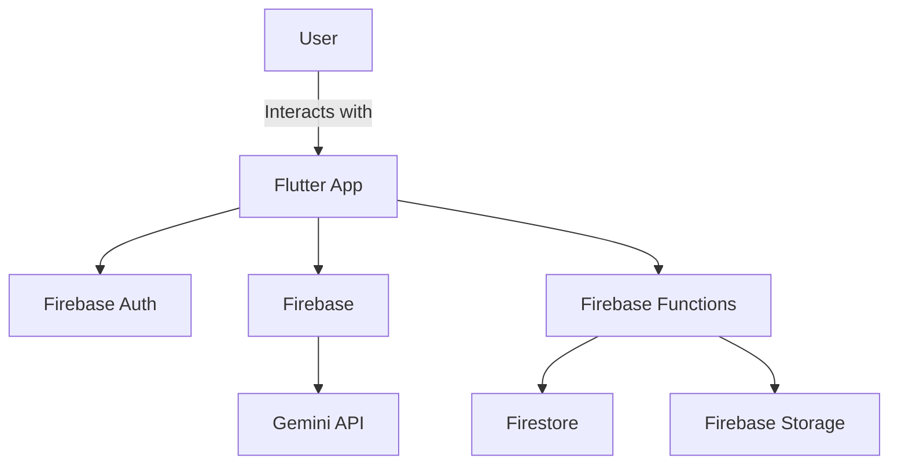
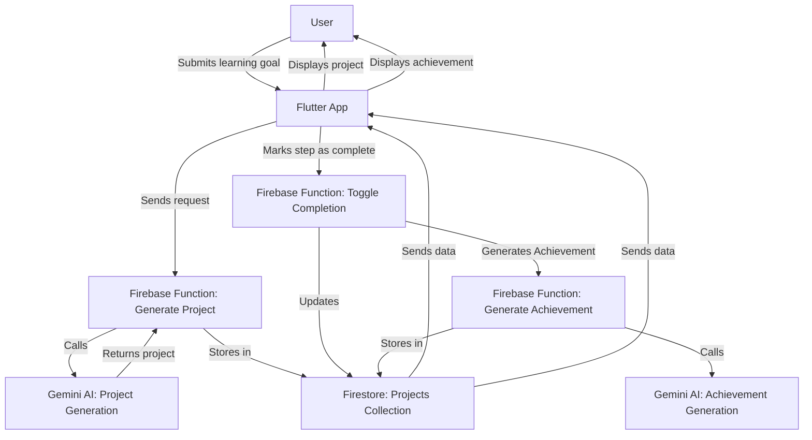

# System Overview

The Launchpad app is a comprehensive learning platform designed to help users gain knowledge and skills through real-world projects. The app is powered by Flutter for the frontend, Firebase for the backend, and integrates with Google’s Gemini AI services for various generative tasks. This document provides a high-level overview of the system architecture, including the key components and how they interact to deliver a seamless user experience.

# Architecture Overview

The Launchpad system is divided into three main components:

1.	Frontend (Flutter App)
2.	Backend (Firebase Services)
3.	AI Integration (Google’s Gemini AI)

## High-Level Architecture Diagram

## Frontend (Flutter App)

The Launchpad frontend is built using Flutter, a cross-platform framework that allows the app to run on various different mobile, desktop, and web platforms. The Flutter app is responsible for:

- **User Interface**: Rendering the UI components, including project lists, achievements, and step-by-step project guides.
- **State Management**: Handling the state of the application using a MVC and service oriented approach, ensuring that the UI updates reactively to changes in the app’s state.
- **Navigation**: Managing navigation between different screens in the app, including project creation, step viewing, and achievement tracking.

## Backend (Firebase Services)

The Launchpad backend leverages several Firebase services to provide authentication, data storage, and cloud functions:

1.	**Firebase Auth**:
	- Purpose: Handles user authentication, including email/password login and social login methods.
	- Flow: When a user logs in, Firebase Auth generates a token that is used to authenticate requests to other Firebase services.
2.	**Firestore**:
	- Purpose: A NoSQL document database used to store user data, projects, steps, and achievements.
	- Structure: Data is organized into collections (e.g., users, projects) and documents within those collections.
	- Security: Access to Firestore data is controlled by Firebase Security Rules, which ensure that users can only access their own data.
3.	**Firebase Functions**:
	- Purpose: A serverless backend that executes custom backend logic in response to HTTPS requests or Firestore events.
	- Use Cases:
	  - Generating AI-driven content such as project steps and achievements.
	  - Handling complex business logic that cannot be efficiently executed on the client-side.
	  - Interfacing with external APIs, such as the Gemini AI services.
4.	**Firebase Storage**:
	- Purpose: Stores content, such as images, related to projects or achievements.
	- Access: Firebase Storage URLs are accessed only through Firebase Functions calls.

## AI Integration (Gemini AI)

The Gemini AI services play a central role in the Launchpad app, powering various generative tasks that enhance the user experience:

1.	**Project Generation**:
	- Task: When a user specifies a learning goal (e.g., “I want to learn how to use a 3D printer”), the Gemini model generates a structured project plan.
	- System Instructions: Instructions for the model are dynamically retrieved from Firebase Remote Config, allowing for real-time adjustments without app updates.
2.	**Achievement Generation**:
	- Task: The Gemini model identifies key steps in the project and generates achievements that users can earn by completing those steps.
3.	**FAQ Generation**:
	- Task: Users can ask questions about their projects. The Gemini model generates answers based on the project content and context.

## Data Flow Diagram

# Conclusion

This document provides a high-level overview of the system architecture. For more detailed information, refer to the specific documentation on each component available in the documentation directory.