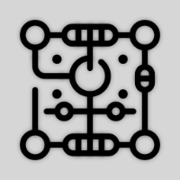

# Gadgetron Flutter App :robot:



[![License: MIT][license_badge]][license_badge_link]
[![style: very good analysis][badge]][badge_link]

Welcome to the Gadgetron Flutter App! This is the core component of the Gadgetron project,
designed to help makers jumpstart their projects in electronics, robotics, IoT, 3D printing, and
more.

## Introduction :wave:

The Gadgetron Flutter App is your personal assistant for scoping out electronics projects,
recommending components, providing learning resources, and offering real-time feedback during the
building process. Say goodbye to “maker’s block” and dive right into your projects with Gadgetron!

## Features :goat:

- **Project Scoping**: Describe your project and get a curated list of components.
- **Component Recommendations**: Discover the best development boards, sensors, and power sources
  for your project.
- **Learning Resources**: Access tutorials, guides, and product recommendations.
- **Build Assistance**: Capture images of your setup for instant feedback and troubleshooting tips.

## Getting Started :rocket:

### Prerequisites

Before you begin, ensure you have met the following requirements:

- Flutter SDK: [Install Flutter](https://docs.flutter.dev/get-started/install)
- A suitable IDE (
  e.g., [Android Studio](https://developer.android.com/studio), [VS Code](https://code.visualstudio.com/))
- An emulator or a physical device for testing

### Installation

1. Clone the repository:

```bash
git clone https://github.com/Toglefritz/Gadgetron
cd gadgetron/flutter_app
```

2. Run the setup-hooks.sh script to install the hooks:

```bash
chmod +x setup-hooks.sh
./setup-hooks.sh
```

3. Install dependencies:

```bash
cd gadgetron_app
flutter pub get
flutter gen-l10n
```

### Running the App

1. Run on an emulator or connected device:

```bash
flutter run
```

## Style Description

The Gadgetron mobile app features a minimalist and modern design, optimized for both aesthetics and
functionality, as well as accessibility. Below is a detailed description of the design style,
highlighting the key elements that define the app’s visual and interactive experience.

### Design Elements

	•	**Near-White Background**: The app employs a near-white background, which enhances brightness and provides a clean, sterile visual experience. This choice creates a neutral canvas that allows content to stand out and reduces visual clutter.
	•	**Clean and Simple Layout**: Emphasizing simplicity, the layout incorporates clean lines and ample white space. This approach ensures an uncluttered interface, improving usability and focus on content.
	•	**Rounded Corners**: Consistent use of rounded corners for UI elements such as buttons, cards, and containers adds to the modern aesthetic. This design choice softens the interface, making it more inviting and user-friendly.
	•	**Neumorphism Elements**: Subtle shadows and highlights are applied to create a neumorphic effect, giving elements a slightly raised or inset appearance. This tactile feel adds depth to the design while maintaining a soft and approachable look.
	•	**Monospace Typography**: The app utilizes a monospace font family, which introduces a distinctive, modern look. This typeface adds a tech-savvy or coding-related vibe to the design, aligning with the app’s innovative and forward-thinking ethos.
	•	**Consistent Iconography**: Simple and consistent icons are used throughout the app, ensuring clarity and coherence. The icon design complements the overall minimalist theme, aiding in intuitive navigation and interaction.

### Design Principles

	•	Minimalist Design: Adopting a “less is more” philosophy, the app’s design minimizes unnecessary elements, focusing on essential functionality and aesthetic appeal.
	•	Modern UI: The use of modern design techniques, such as neumorphism and rounded corners, positions the app at the forefront of current design trends.
	•	Bright and Neutral Palette: The near-white background combined with subtle color accents enhances readability and visual comfort.
	•	Tech-Savvy Aesthetic: The monospace typography reinforces the app’s alignment with technology and innovation, appealing to users who value modern, tech-oriented design.

By incorporating these design elements and principles, the Gadgetron mobile app delivers a visually
appealing and highly functional user experience. This thoughtful design approach ensures that users
can easily navigate and interact with the app, while also appreciating its modern and minimalist
aesthetic.

## Contributing :raised_hands:

Contributions are welcome! If you have ideas for new features, improvements, or bug fixes, feel free
to submit a pull request or open an issue.

Steps to Contribute

	1.	Fork the repository.
	2.	Create a new branch (git checkout -b feature-name).
	3.	Make your changes.
	4.	Commit your changes (git commit -m 'Add some feature').
	5.	Push to the branch (git push origin feature-name).
	6.	Open a pull request.

## License :page_facing_up:

This project is licensed under the MIT License - see the LICENSE file for details.

[badge]: https://img.shields.io/badge/style-very_good_analysis-B22C89.svg

[badge_link]: https://pub.dev/packages/very_good_analysis

[license_badge]: https://img.shields.io/badge/license-MIT-blue.svg

[license_badge_link]: https://opensource.org/licenses/MIT